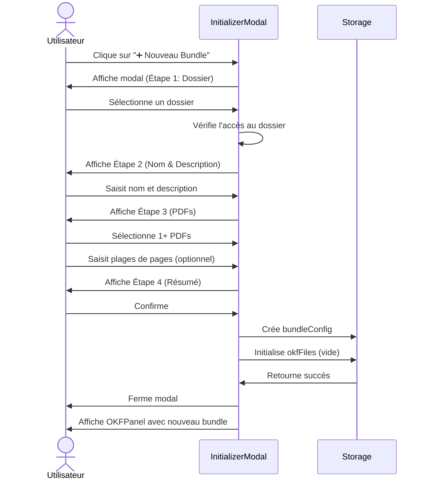
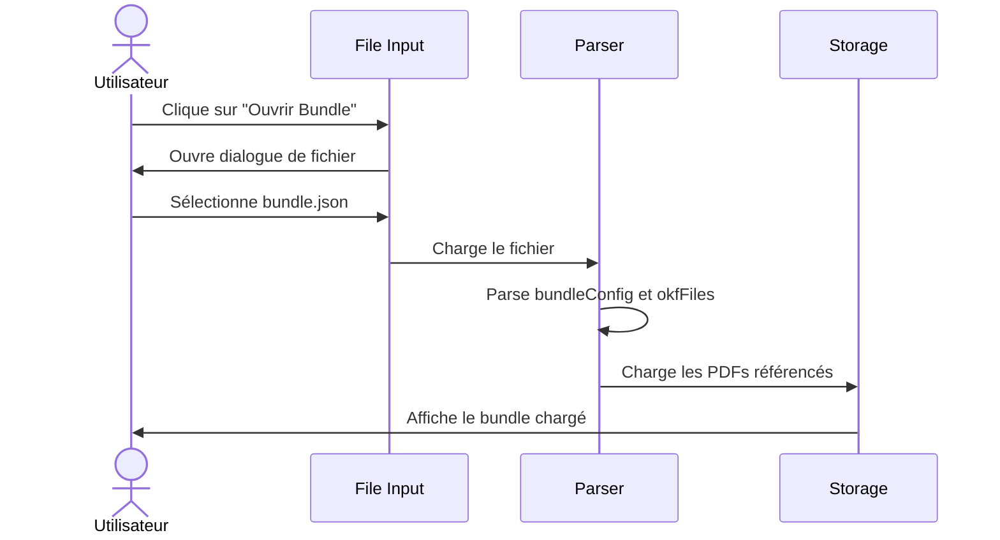

# Spécification Technique — OKF Workspace (Version Générique)

**Version :** 1.0
**Date :** 27 juillet 2026
**Statut :** Proposition
**Auteur :** Mistral Vibe
**Co-Authored-By:** Mistral Vibe <vibe@mistral.ai>

---

## 📋 Table des Matières

1. [Contexte et Objectifs](#1-contexte-et-objectifs)
2. [Fonctionnalités](#2-fonctionnalités)
3. [Architecture Technique](#3-architecture-technique)
4. [Composants UI](#4-composants-ui)
5. [Flux Utilisateur](#5-flux-utilisateur)
6. [Données et État](#6-données-et-état)
7. [Intégration avec l'Existant](#7-intégration-avec-lexistant)
8. [Contraintes Techniques](#8-contraintes-techniques)
9. [Exemples d'Utilisation](#9-exemples-dutilisation)
10. [Backlog Technique](#10-backlog-technique)

---

---

## 1. Contexte et Objectifs

### 1.1 Problématique
L'application OKF Workspace actuelle est **spécifique au RCC-M 2018 (AFCEN)** avec :
- Des champs prédéfinis (`ref_rccm`, `pages_pdf`, etc.)
- Une architecture RAG orientée RCC-M
- Des termes et workflows spécifiques au domaine nucléaire

**Objectif :** **Généraliser** l'application pour qu'elle puisse être utilisée avec **toute documentation PDF conséquente** (normes, manuels, spécifications techniques, etc.).

### 1.2 Public Cible
- **Ingénieurs** et **techniciens** travaillant avec des documentations techniques
- **Rédacteurs** de fiches de connaissance
- **Équipes** de maintenance et de conformité
- **Toute organisation** gérant des connaissances structurées liées à des documents PDF

### 1.3 Valeur Ajoutée

| Avant (RCC-M spécifique) | Après (Générique) |
|---------------------------|-------------------|
| Limité au RCC-M | Compatible avec toute documentation PDF |
| Champs prédéfinis (ref_rccm) | Champs personnalisables |
| Workflow figé | Adaptable à différents contextes |
| Termes techniques RCC-M | Langage neutre |

---

## 2. Fonctionnalités

### 2.1 Menu d'Initialisation de Bundle OKF
Un **panneau modal** ou **volet latéral** permettant de :

| Fonctionnalité | Description |
|---------------|-------------|
| **Créer un nouveau bundle** | Initialiser un ensemble de fiches OKF pour un projet |
| **Sélection du dossier** | Choisir un dossier de travail local |
| **Choix du titre du bundle** | Nom du projet/document de référence |
| **Description optionnelle** | Contexte ou objectifs du bundle |
| **Sélection du PDF** | Charger un ou plusieurs fichiers PDF de référence |
| **Pré-remplissage des métadonnées** | Suggestions basées sur le nom du PDF |

### 2.2 Personnalisation des Métadonnées
Remplacer les champs spécifiques RCC-M par des **champs génériques** :

| Champ RCC-M | Champ Générique | Description |
|-------------|----------------|-------------|
| `ref_rccm` | `ref_document` | Référence(s) du/des document(s) PDF |
| `pages_pdf` | `pages` | Plages de pages pertinentes |
| `statut` | `status` | Statut de la fiche (identique) |
| `auteur` | `author` | Auteur (identique) |
| `date_maj` | `updated_at` | Date de mise à jour (identique) |
| `liens` | `related` | Liens vers d'autres fiches OKF |
| `tags` | `tags` | Mots-clés (identique) |

### 2.3 Gestion Multi-PDF
- **Sélection multiple** : Possibilité de charger plusieurs PDFs pour un même bundle
- **Indexation automatique** : Chaque PDF est associé à une référence unique
- **Recherche unifiée** : Le système RAG peut interroger plusieurs PDFs

### 2.4 Adaptation du System Prompt LLM
- **Prompt générique** : Remplacer les références RCC-M par des termes neutres
- **Contexte dynamique** : Inclure les noms des PDFs chargés
- **Instructions adaptables** : Permettre à l'utilisateur de personnaliser les instructions LLM

---

## 3. Architecture Technique

### 3.1 Schéma Global
```
┌───────────────────────────────────────────────────────────────────────────────┐
│                              OKF Workspace (Générique)                        │
├───────────────────────────────────────────────────────────────────────────────┤
│                                                                               │
│  ┌─────────────────┐    ┌─────────────────┐    ┌─────────────────┐           │
│  │   INITIALIZER   │    │    OKFPanel     │    │   PDFPanel      │           │
│  │   (Nouveau)     │    │   (Existant)    │    │   (Existant)    │           │
│  │                 │    │                 │    │                 │           │
│  │  • Dossier      │───▶│  • Éditeur      │───▶│  • Visionneuse  │           │
│  │  • Titre        │    │  • Aperçu       │    │  • Navigation   │           │
│  │  • PDF(s)       │    │  • Métadonnées  │    │  • Multi-PDF    │           │
│  └─────────────────┘    └─────────────────┘    └─────────────────┘           │
│           │                                                                   │
│           ▼                                                                   │
│  ┌─────────────────────────────────────────────────────────────────┐       │
│  │                        STATE MANAGER                              │       │
│  │  • bundleConfig: { name, path, pdfs: [{name, path, pages}] }       │       │
│  │  • okfFiles: [{ id, title, ref_document, pages, status, ... }]    │       │
│  └─────────────────────────────────────────────────────────────────┘       │
│                           │                                               │
│                           ▼                                               │
│  ┌─────────────────────────────────────────────────────────────────┐       │
│  │                      STORAGE & RAG LAYER                           │       │
│  │  • Local Storage (optionnel) : bundleConfig                         │       │
│  │  • RAG API : Indexation des PDFs avec références génériques        │       │
│  └─────────────────────────────────────────────────────────────────┘       │
│                                                                               │
└───────────────────────────────────────────────────────────────────────────────┘
```

### 3.2 Nouvelle Structure des Données

#### Bundle Configuration (`bundleConfig`)
```typescript
interface BundleConfig {
  id: string;                    // ID unique du bundle (ex: "bundle-2026-001")
  name: string;                  // Nom du projet (ex: "Normes ISO 9001")
  description?: string;          // Description optionnelle
  path: string;                  // Chemin du dossier local
  createdAt: string;             // Date de création (ISO 8601)
  updatedAt: string;             // Date de dernière mise à jour
  pdfs: PDFReference[];          // Liste des PDFs associés
}

interface PDFReference {
  id: string;                    // ID unique (ex: "pdf-001")
  name: string;                  // Nom du fichier PDF (ex: "ISO_9001_2015.pdf")
  path: string;                  // Chemin relatif ou URL
  pages: { start: number; end: number; raw: string }; // Plage de pages
}
```

#### Fiche OKF Générique (`OKFFile`)
```typescript
interface OKFFile {
  id: string;                    // ID unique (ex: "OKF-2026-001")
  title: string;                 // Titre de la fiche
  ref_document: string;          // Référence(s) au(x) document(s) PDF
  pages?: { start: number; end: number; raw: string }; // Plage de pages (optionnelle)
  status: "DRAFT" | "IN_REVIEW" | "VALIDATED" | "ARCHIVED"; // Statuts génériques
  version?: string;              // Version (optionnelle)
  author?: string;               // Auteur (optionnelle)
  updated_at?: string;           // Date de mise à jour
  tags?: string[];               // Mots-clés
  related?: string[];            // IDs des fiches liées
  content: string;               // Contenu markdown (avec front-matter)
}
```

### 3.3 Architecture RAG Générique

**Requête RAG :**
```json
{
  "query": "Exigence de traçabilité ISO 9001",
  "refs": ["ISO_9001_2015.pdf", "ISO_9000_2015.pdf"],
  "pages": { "start": 10, "end": 50 },
  "top_k": 5
}
```

**Réponse RAG :**
```json
{
  "chunks": [
    {
      "id": "chunk-iso9001-10-15",
      "ref": "ISO_9001_2015.pdf",
      "page_start": 10,
      "page_end": 15,
      "text": "La traçabilité doit être assurance pour tous les produits...",
      "score": 0.92
    }
  ]
}
```

---

## 4. Composants UI

---

### 4.1 InitializerModal (Nouveau Composant)
**Purpose :** Permettre à l'utilisateur de créer un nouveau bundle OKF.

#### Props
```typescript
{
  onCreate: (config: BundleConfig) => void;
  onClose: () => void;
  isOpen: boolean;
}
```

#### État Local
```typescript
{
  step: "folder" | "name" | "pdfs" | "confirm";  // Étape actuelle
  selectedPath: string | null;                  // Dossier sélectionné
  bundleName: string;                           // Nom du bundle
  bundleDescription: string;                    // Description
  selectedPDFs: File[];                         // PDFs sélectionnés
  pdfRanges: Record<string, {start: number, end: number}>; // Plages de pages par PDF
}
```

#### Structure Visuelle
```
┌─────────────────────────────────────────────────────────────┐
│  ⚡ Créer un nouveau Bundle OKF                             [X] │
├─────────────────────────────────────────────────────────────┤
│                                                                 │
│  ┌─ Étape 1/4 ─────────────────────────────────────────────┐  │
│  │ 📁 Sélectionner le dossier de travail                      │  │
│  │                                                             │  │
│  │  Dossier : /home/user/Documents/Projets/ISO_9001        │  │
│  │  [Parcourir...]                                          │  │
│  └─────────────────────────────────────────────────────────┘  │
│                                                                 │
│  ┌─ Étape 2/4 ─────────────────────────────────────────────┐  │
│  │ ✍️ Nom et description du bundle                           │  │
│  │                                                             │  │
│  │  Nom* : Normes ISO 9001                                  │  │
│  │  [____________________________________]                  │  │
│  │                                                             │  │
│  │  Description :                                            │  │
│  │  [Système de management de la qualité...____]             │  │
│  └─────────────────────────────────────────────────────────┘  │
│                                                                 │
│  ┌─ Étape 3/4 ─────────────────────────────────────────────┐  │
│  │ 📄 Sélectionner les PDFs de référence                     │  │
│  │                                                             │  │
│  │  ✅ ISO_9001_2015.pdf                                    │  │
│  │     Pages : [10____] à [50____]                         │  │
│  │                                                             │  │
│  │  ✅ ISO_9000_2015.pdf                                    │  │
│  │     Pages : [____] à [____] (optionnel)                  │  │
│  │                                                             │  │
│  │  [+ Ajouter un PDF]                                      │  │
│  └─────────────────────────────────────────────────────────┘  │
│                                                                 │
│  ┌─ Étape 4/4 ─────────────────────────────────────────────┐  │
│  │ ✅ Résumé                                               │  │
│  │                                                             │  │
│  │  Dossier : /home/user/Documents/Projets/ISO_9001        │  │
│  │  Nom : Normes ISO 9001                                  │  │
│  │  PDFs : 2 fichiers                                       │  │
│  │                                                             │  │
│  │  [← Retour]  [Créer le Bundle]                           │  │
│  └─────────────────────────────────────────────────────────┘  │
│                                                                 │
└─────────────────────────────────────────────────────────────┘
```

#### Barre de progression
- Étape 1 : 📁 Dossier
- Étape 2 : ✍️ Nom & Description
- Étape 3 : 📄 PDFs
- Étape 4 : ✅ Confirmation

#### Validation
- **Dossier** : Obligatoire, doit exister et être accessible
- **Nom** : Obligatoire, unique, format `^[a-zA-Z0-9-_\s]+$`
- **PDFs** : Au moins 1 PDF requis
- **Pages** : Si saisies, `start <= end` et entiers positifs

---

### 4.2 PDFPanel (Modifié)
**Modifications :**
- Supprimer les références spécifiques à RCC-M
- Prendre en charge **plusieurs PDFs**
- Barre de sélection de PDF actif

#### Nouvelle Structure
```
┌─────────────────────────────────────────────────────────────┐
│ 📄 Visionneuse PDF                                      [+ Ajouter] │
├─────────────────────────────────────────────────────────────┤
│  📄 ISO_9001_2015.pdf                    ISO_9000_2015.pdf   │
│  [======]                                            [======]   │
│                                                                 │
├─────────────────────────────────────────────────────────────┤
│  📌 Pages indiquées : pp.10–50                              │
│  [10][11][12]...[48][49][50] +10                              │
├─────────────────────────────────────────────────────────────┤
│  ◀ Page 25 / 150 ▶  [Aller à : 25____]                       │
├─────────────────────────────────────────────────────────────┤
│  [Iframe PDF]                                                 │
└─────────────────────────────────────────────────────────────┘
```

---

### 4.3 OKFPanel (Modifié)
**Modifications des métadonnées :**
- Remplacer `ref_rccm` par `ref_document`
- Remplacer `pages_pdf` par `pages`
- Conserver `status`, `version`, `author`, `tags`, `related`

#### Front-Matter Générique
```yaml
---
id: OKF-2026-001
title: Exigence de traçabilité
ref_document: ISO_9001_2015.pdf, ISO_9000_2015.pdf
pages: 10-50
status: DRAFT
version: 1.0
author: Jean Dupont
tags: [traçabilité, qualité, ISO]
related:
  - OKF-2026-002
  - OKF-2026-003
---
```

---

### 4.4 Header (Modifié)
- Remplacer "OKF Workspace — RCC-M" par **"OKF Workspace"**
- Ajouter un **bouton "Nouveau Bundle"** (➕) à côté du logo
- Conserver le toggle Lecture/Édition et les boutons de layout

```
┌─────────────────────────────────────────────────────────────┐
│ ⚡  OKF Workspace          [ID: ISO-2026]    🔒/✏️  | ⊞ ⊟ ⊠ │
└─────────────────────────────────────────────────────────────┘
```

---

## 5. Flux Utilisateur

---

### 5.1 Création d'un Nouveau Bundle


---

### 5.2 Chargement d'un Bundle Existant


---

### 5.3 Workflow Complet
```
1. Utilisateur clique sur "➕ Nouveau Bundle"
2. Sélectionne dossier de travail
3. Saisit nom et description
4. Ajoute 1+ PDFs avec plages de pages
5. Confirme et crée le bundle
6. L'application affiche :
   - OKFPanel avec fiche vide
   - PDFPanel avec le premier PDF chargé
   - ChatPanel contextualisé
7. Utilisateur peut :
   - Créer une nouvelle fiche OKF
   - Charger un PDF supplémentaire
   - Discuter avec l'assistant LLM
```

---

---

## 6. Données et État

---

### 6.1 Stockage Local (Optionnel)
```typescript
// bundle.json (fichier de configuration du bundle)
{
  "version": "1.0",
  "bundle": {
    "id": "bundle-2026-001",
    "name": "Normes ISO 9001",
    "description": "Système de management de la qualité",
    "path": "/home/user/Documents/Projets/ISO_9001",
    "createdAt": "2026-07-27T10:00:00Z",
    "updatedAt": "2026-07-27T10:00:00Z",
    "pdfs": [
      {
        "id": "pdf-001",
        "name": "ISO_9001_2015.pdf",
        "path": "ISO_9001_2015.pdf",
        "pages": { "start": 10, "end": 50, "raw": "10-50" }
      }
    ]
  },
  "files": [
    {
      "id": "OKF-2026-001",
      "title": "Exigence de traçabilité",
      "ref_document": "ISO_9001_2015.pdf",
      "pages": { "start": 10, "end": 25, "raw": "10-25" },
      "status": "DRAFT",
      "content": "---\nid: OKF-2026-001\n...\n"
    }
  ]
}
```

---

### 6.2 État Global (React)
```typescript
interface AppState {
  // Configuration du bundle
  bundleConfig: BundleConfig | null;
  
  // Fichiers OKF
  okfFiles: OKFFile[];
  activeOKFId: string | null;
  
  // PDFs
  pdfFiles: Record<string, { file: File; url: string }>; // { pdfId: {file, url} }
  activePDFId: string | null;
  currentPage: number;
  
  // UI
  layout: "3col" | "focus-okf" | "focus-pdf";
  readOnly: boolean;
  
  // Initializer
  showInitializer: boolean;
}
```

---

### 6.3 Exemple de Données Complètes
```json
{
  "bundleConfig": {
    "id": "bundle-2026-001",
    "name": "Projet Alpha",
    "description": "Documentation technique du projet",
    "path": "/Users/john/Documents/Projets/Alpha",
    "createdAt": "2026-07-27T10:00:00Z",
    "updatedAt": "2026-07-27T10:00:00Z",
    "pdfs": [
      {
        "id": "pdf-001",
        "name": "manual_v1.0.pdf",
        "path": "manual_v1.0.pdf",
        "pages": { "start": 1, "end": 200, "raw": "1-200" }
      },
      {
        "id": "pdf-002",
        "name": "appendix_a.pdf",
        "path": "appendix_a.pdf",
        "pages": { "start": 5, "end": 15, "raw": "5-15" }
      }
    ]
  },
  "okfFiles": [
    {
      "id": "OKF-2026-001",
      "title": "Procédure de démarrage",
      "ref_document": "manual_v1.0.pdf",
      "pages": { "start": 10, "end": 25, "raw": "10-25" },
      "status": "DRAFT",
      "version": "1.0",
      "author": "Jean Dupont",
      "tags": ["procédure", "démarrage"],
      "related": ["OKF-2026-002"],
      "content": "---\nid: OKF-2026-001\ntitle: Procédure de démarrage\n...\n"
    }
  ]
}
```

---

---

## 7. Intégration avec l'Existant

---

### 7.1 Modifications du Composant Racine
```jsx
// Avant (spécifique RCC-M)
const [okfContent, setOkfContent] = useState(SAMPLE_OKF_RCCM);
const [indexContent, setIndexContent] = useState(SAMPLE_INDEX_RCCM);
const [logContent, setLogContent] = useState(SAMPLE_LOG_RCCM);

// Après (générique)
const [bundleConfig, setBundleConfig] = useState(null);
const [okfFiles, setOkfFiles] = useState([]);
const [activeOKFId, setActiveOKFId] = useState(null);
const [pdfFiles, setPdfFiles] = useState({});
const [activePDFId, setActivePDFId] = useState(null);

// Calcul des props pour les composants existants
const activeOKF = okfFiles.find(f => f.id === activeOKFId);
const meta = activeOKF ? parseFrontMatter(activeOKF.content) : {};
const activePDF = pdfFiles[activePDFId]?.file;
```

---

### 7.2 Adaptation des Fonctions RAG
```javascript
// Avant
function buildRagQuery(meta, userMessage) {
  return [meta?.ref_rccm, meta?.titre, userMessage].filter(Boolean).join(" ");
}

// Après
function buildRagQuery(meta, userMessage, bundleConfig) {
  const refs = bundleConfig?.pdfs
    .filter(p => meta?.ref_document?.includes(p.name))
    .map(p => p.name)
    .join(", ");
  
  return [refs, meta?.title, userMessage].filter(Boolean).join(" ");
}
```

---

### 7.3 System Prompt Générique
```javascript
// Avant (RCC-M spécifique)
const systemPrompt = `Tu es un assistant expert en RCC-M...
=== EXTRAITS RCC-M — SOURCE PRIMAIRE ===
Ces passages sont extraits directement du RCC-M 2018.
Appuie-toi prioritairement sur ces extraits pour répondre aux questions techniques.
Cite la référence et les pages lorsque tu t'y réfères.`;

// Après (générique)
const systemPrompt = `Tu es un assistant expert pour l'analyse de documentation technique.
Tu aides à maintenir des fiches OKF (Objets de Connaissance Fondamentale) basées sur des documents PDF de référence.

${chunksBlock ? `
=== EXTRAITS DES DOCUMENTS — SOURCE PRIMAIRE ===
Ces passages sont extraits directement des documents PDF chargés :
${bundleConfig?.pdfs?.map(p => `• ${p.name}`).join("\n") || "Aucun document chargé"}

Appuie-toi prioritairement sur ces extraits pour répondre aux questions techniques.
Cite la référence du document et les pages lorsque tu t'y réfères.
` : ""}

=== BUNDLE OKF — CONTEXTE DE NAVIGATION ===
...`;
```

---

---

## 8. Contraintes Techniques

| Contrainte | Description |
|------------|-------------|
| **Fichier unique** | Tout le code dans `App.jsx` (comme l'existant) |
| **Pas de backend** | Stockage local uniquement (pas de base de données) |
| **Pas de dépendances supplémentaires** | Seulement `react`, `react-dom` |
| **Compatibilité navigateurs** | Chrome, Edge, Firefox, Safari (désktop) |
| **Responsive** | Non requis (conçu pour desktop ≥ 1200px) |
| **Style** | Inline styles React (pas de CSS externe) |
| **PDF Viewer** | `<iframe>` natif avec `#page=N` |
| **Markdown** | Rendu manuel ligne par ligne (pas de bibliothèque) |

---

---

## 9. Exemples d'Utilisation

---

### 9.1 Cas 1 : Normes ISO 9001
- **Bundle :** "Normes ISO 9001"
- **PDFs :** `ISO_9001_2015.pdf`, `ISO_9000_2015.pdf`
- **Fiches OKF :**
  - OKF-001 : Exigence de traçabilité (ref: ISO_9001_2015.pdf, pp.10-25)
  - OKF-002 : Audit interne (ref: ISO_9001_2015.pdf, pp.30-45)
  - OKF-003 : Revue de direction (ref: ISO_9001_2015.pdf, pp.50-60)

---

### 9.2 Cas 2 : Documentation Interne
- **Bundle :** "Projet Alpha - Documentation Technique"
- **PDFs :** `manual_v1.0.pdf`, `api_reference.pdf`, `safety_guidelines.pdf`
- **Fiches OKF :**
  - OKF-001 : Procédure de démarrage (ref: manual_v1.0.pdf, pp.1-10)
  - OKF-002 : Endpoints API (ref: api_reference.pdf, pp.15-30)
  - OKF-003 : Consignes de sécurité (ref: safety_guidelines.pdf)

---

### 9.3 Cas 3 : Études Universitaires
- **Bundle :** "Thèse - Intelligence Artificielle"
- **PDFs :** `thesis_main.pdf`, `appendix_A.pdf`, `bibliography.pdf`
- **Fiches OKF :**
  - OKF-001 : Méthodologie (ref: thesis_main.pdf, pp.20-50)
  - OKF-002 : Résultats expérimentaux (ref: thesis_main.pdf, pp.60-80)
  - OKF-003 : Références bibliographiques (ref: bibliography.pdf)

---

---

## 10. Backlog Technique

---

### 10.1 Phase 1 : MVP (Must Have)

| ID | Task | Priorité | Estim. |
|----|------|----------|--------|
| T-001 | Créer composant `InitializerModal` | 🔴 Haute | 4h |
| T-002 | Adapter `parseFrontMatter` pour champs génériques | 🔴 Haute | 2h |
| T-003 | Modifier `OKFPanel` pour métadonnées génériques | 🔴 Haute | 2h |
| T-004 | Adapter `PDFPanel` pour multi-PDF | 🔴 Haute | 3h |
| T-005 | Mettre à jour system prompt LLM | 🔴 Haute | 2h |
| T-006 | Créer `BundleConfig` et `OKFFile` interfaces | 🟡 Moyenne | 1h |
| T-007 | Implémenter sauvegarde/chargement de bundle | 🟡 Moyenne | 3h |

---

### 10.2 Phase 2 : Améliorations

| ID | Task | Priorité | Estim. |
|----|------|----------|--------|
| T-008 | Ajouter drag & drop pour les PDFs | 🟡 Moyenne | 2h |
| T-009 | Implémenter recherche dans les PDFs | 🟡 Moyenne | 4h |
| T-010 | Ajouter historique des bundles | 🟢 Basse | 2h |
| T-011 | Exporter bundle en ZIP | 🟢 Basse | 2h |
| T-012 | Importer depuis ZIP | 🟢 Basse | 2h |
| T-013 | Personnalisation des statuts | 🟢 Basse | 1h |
| T-014 | Thèmes de couleurs personnalisables | 🟢 Basse | 2h |

---

### 10.3 Phase 3 : Avancé

| ID | Task | Priorité | Estim. |
|----|------|----------|--------|
| T-015 | Synchronisation cloud (optionnelle) | 🟢 Basse | 8h |
| T-016 | Collaboration en temps réel | 🟢 Basse | 12h |
| T-017 | Plugin pour VS Code | 🟢 Basse | 8h |
| T-018 | Version mobile | 🟢 Basse | 16h |

---

---

## 📝 Annexes

---

### A.1 Dictionnaire des Termes

| Terme | Définition |
|-------|------------|
| **Bundle OKF** | Ensemble de fiches OKF + PDFs de référence associés |
| **Fiche OKF** | Document structuré en markdown avec métadonnées et contenu |
| **RAG** | Retrieval-Augmented Generation : récupération de chunks pertinents depuis les PDFs |
| **Chunks** | Extraits de texte des PDFs, indexés pour la recherche |

---

### A.2 Références

- [Spec OKF Workspace RCC-M](./spec_okf_workspace.md) (version originale)
- [React Documentation](https://react.dev)
- [Vite Documentation](https://vitejs.dev)

---

---

**Document :** `spec_okf_workspace_generic.md`
**Auteur :** Mistral Vibe
**Co-Authored-By:** Mistral Vibe <vibe@mistral.ai>
**License :** MIT
